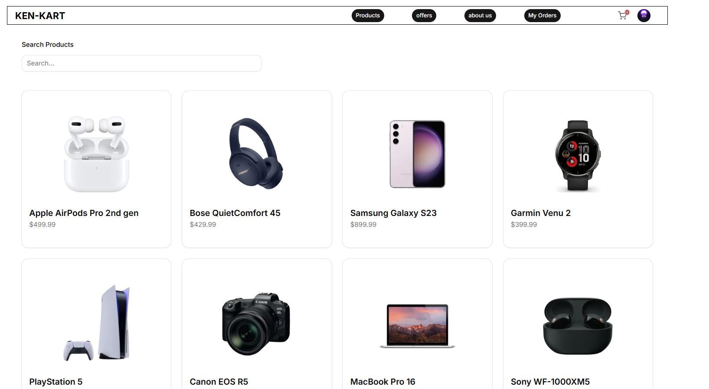
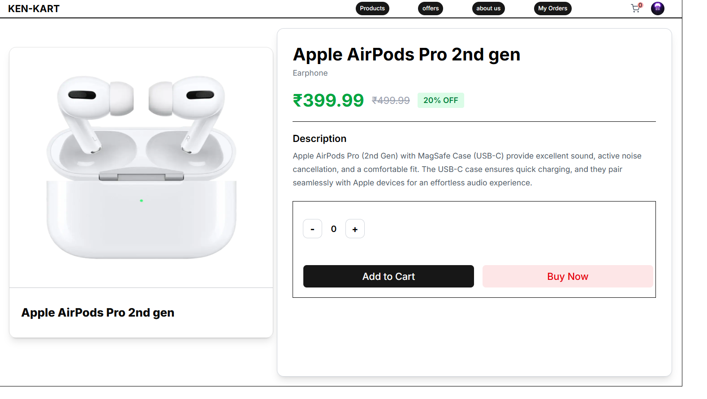
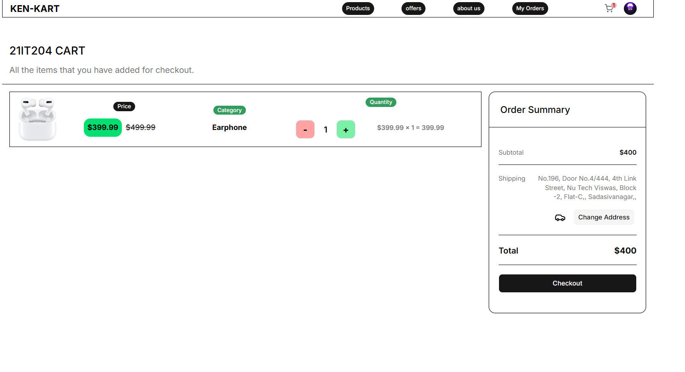
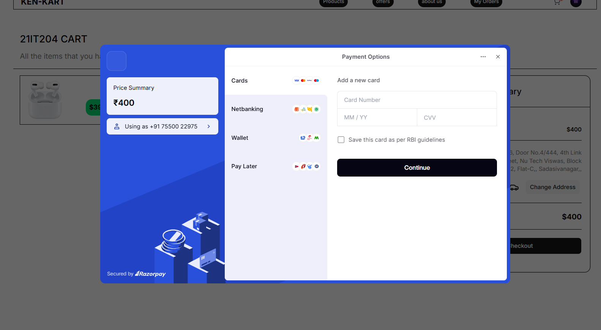
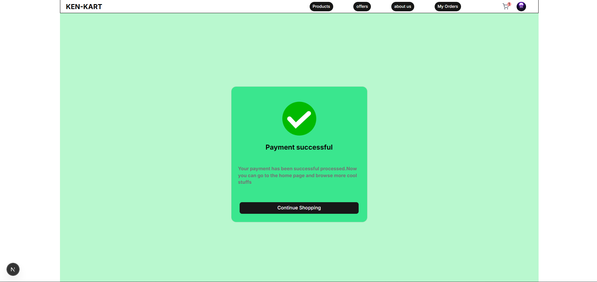
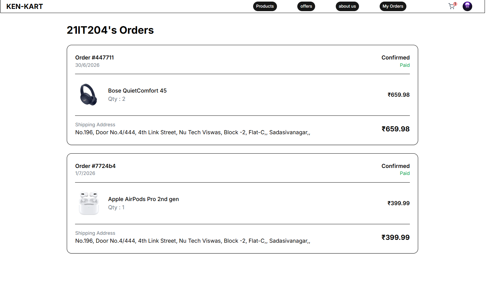

# Kenkart 🛒

Kenkart is a premium, feature-rich, role-based e-commerce platform built using Next.js 16 (App Router), TypeScript, and MongoDB. It integrates **Clerk** for robust authentication, **Razorpay** for seamless payment processing, and **Cloudinary** for scalable image storage and seller uploads.

---

## 📸 Project Showcase

### User Interface & Storefront
<p align="center">
  
  
</p>

<p align="center">
  
  
</p>

<p align="center">
  
  
</p>

### Role-Based Dashboards
<p align="center">
  
  
</p>

---

## 🌟 Key Features

-   **🔑 Role-Based Access Control**:
    -   **Buyers**: Browse products, manage cart contents, checkout with dynamic shipping, and trace orders.
    -   **Sellers**: Manage and upload products with image previews, tracking store performance.
    -   **Admins**: Comprehensive control over products, orders, and users.
-   **💳 Razorpay Checkout Integration**: Secure checkout pipeline handling order instantiation, verification signatures, and success/failed callbacks.
-   **🖼️ Cloudinary Uploads**: Interactive product creation with responsive image preview handling.
-   **🔄 Live Synchronized State**: Custom React Context syncing Clerk profile details with MongoDB schemas instantly upon authentication (`/api/user/syncuser`).
-   **🎨 Premium Modern UI**: Tailwind CSS combined with `@tailwindcss/postcss`, styled using customizable shadcn/ui primitives for maximum sleekness and responsiveness.

---

## 🛠️ Tech Stack

-   **Framework**: [Next.js 16 (App Router)](https://nextjs.org/) & [React 19](https://react.dev/)
-   **Styling**: [Tailwind CSS v4](https://tailwindcss.com/) & [shadcn/ui](https://ui.shadcn.com/)
-   **Database**: [MongoDB](https://www.mongodb.com/) via [Mongoose](https://mongoosejs.com/) ORM
-   **Authentication**: [Clerk Next.js SDK](https://clerk.com/)
-   **Payments**: [Razorpay API](https://razorpay.com/)
-   **Storage**: [Cloudinary SDK](https://cloudinary.com/)
-   **HTTP Client**: [Axios](https://axios-http.com/)

---

## 📁 Directory Structure

```text
kenkart/
├── app/                  # Next.js App Router Pages & APIs
│   ├── (orders)/         # Order flow routes (success, failure, summary)
│   ├── api/              # Backend API routes (user syncing, Razorpay webhooks, etc.)
│   ├── cart/             # Shopping Cart UI
│   ├── dashboard/        # Dashboards (Admin and Seller views)
│   ├── products/         # Product view pages
│   ├── layout.tsx        # Global Layout
│   └── page.tsx          # Homepage
├── components/           # Reusable Client & Server components
│   ├── ui/               # Shadcn UI primitives
│   ├── navbar.tsx        # Responsive Header Navigation
│   ├── selleradd.tsx     # Cloudinary-powered Product Uploader
│   └── ...               # Cart items, counts, and summaries helpers
├── context/              # React Context API for Global User/Cart State
├── lib/                  # Configurations (MongoDB connection, Razorpay, Cloudinary)
├── models/               # MongoDB/Mongoose Schema Definitions (User, Product, Order)
├── public/               # Static assets
└── tsconfig.json         # TypeScript configuration
```

---

## ⚙️ Getting Started & Local Setup

### Prerequisites
-   Ensure you have [Node.js](https://nodejs.org/) (v18.x or later) installed.
-   A local [MongoDB](https://www.mongodb.com/try/download/community) server running, or a MongoDB Atlas connection URI.
-   Account setups for Clerk, Razorpay (test keys), and Cloudinary.

### 1. Clone the repository
```bash
git clone https://github.com/yourusername/kenkart.git
cd kenkart
```

### 2. Install dependencies
```bash
npm install
```

### 3. Setup Environment Variables
Create a `.env.local` file in the root directory and copy the template below:

```env
# Clerk Authentication Configuration
NEXT_PUBLIC_CLERK_PUBLISHABLE_KEY=your_clerk_publishable_key
CLERK_SECRET_KEY=your_clerk_secret_key

# Database Connectivity
MONGO_URI=mongodb://localhost:27017/kenkart

# Razorpay Credentials (Test keys recommended for development)
TEST_API_KEY=your_razorpay_key_id
TEST_KEY_SECRET=your_razorpay_key_secret
NEXT_PUBLIC_RAZORPAY_KEY=your_razorpay_key_id

# Cloudinary Storage Configuration
CLOUDINARY_CLOUD_NAME=your_cloudinary_cloud_name
CLOUDINARY_API_KEY=your_cloudinary_api_key
CLOUDINARY_API_SECRET=your_cloudinary_api_secret
```

### 4. Run the Development Server
```bash
npm run dev
```

Visit [http://localhost:3000](http://localhost:3000) in your browser to interact with the application.

---

## 🔒 Authentication Flow
This application uses **Clerk** for user management. 
When a user signs in for the first time:
1. Clerk issues a session.
2. The custom `UserContext` automatically triggers the `/api/user/syncuser` endpoint.
3. The server validates the Clerk token, creates a corresponding `User` document in MongoDB, and maps roles (buyer/seller/admin) accordingly.

---

## 💳 Payments Integration
The checkout workflow integrates with **Razorpay Checkout API**:
- **Initiate Order**: The cart routes send a request to standardise checkout calculations on the server side.
- **Pay**: The Razorpay SDK loads in the client interface, displaying a premium modal for mock cards/UPI payments.
- **Callback Verification**: The server verifies payment authenticity using HMAC-SHA256 signature verification via `crypto` before logging the order state as `paid` or `failed`.

---

## 🤝 Contributing
1. Fork the Project.
2. Create your Feature Branch (`git checkout -b feature/AmazingFeature`).
3. Commit your Changes (`git commit -m 'Add some AmazingFeature'`).
4. Push to the Branch (`git push origin feature/AmazingFeature`).
5. Open a Pull Request.
